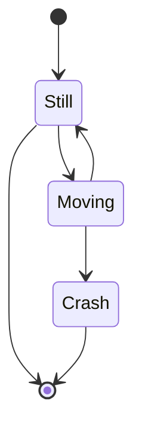

<!-- 
h-[calc(100vh-60px)] "> -->
  
  

    
    

      
      
      
      

          
          

              {{site.data.ransomware[filname].tabs.MITRE.Description}}
          

              
          
              
          
              
          
              
          

          
      

      
  

  

